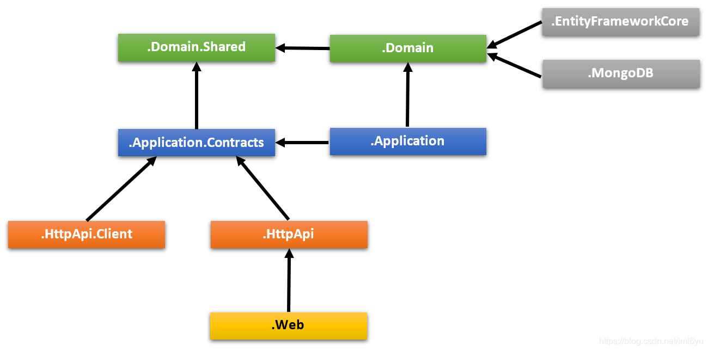

### .Domain.Shared 项目

项目包含常量,枚举和其他对象,这些对象实际上是领域层的一部分,但是解决方案中所有的层/项目中都会使用到.
例如 IssueType 枚举和 IssueConsts 类 (可能是 Issue 实体用到的常数字段,像MaxTitleLength)都适合放在这个项目中.

该项目不依赖解决方案中的其他项目. 其他项目直接或间接依赖该项目.

### .Domain 项目

解决方案的领域层. 它主要包含 实体, 集合根, 领域服务, 值类型, 仓储接口 和解决方案的其他领域对象.

例如 Issue 实体, IssueManager 领域服务和 IIssueRepository 接口都适合放在这个项目中.

它依赖 .Domain.Shared 项目,因为项目中会用到它的一些常量,枚举和定义其他对象.

### .Application.Contracts 项目

项目主要包含 应用服务 interfaces 和应用层的 数据传输对象 (DTO). 它用于分离应用层的接口和实现. 这种方式可以将接口项目做为约定包共享给客户端.

例如 IIssueAppService 接口和 IssueCreationDto 类都适合放在这个项目中.

它依赖 .Domain.Shared 因为它可能会在应用接口和DTO中使用常量,枚举和其他的共享对象.

### .Application 项目

项目包含 .Application.Contracts 项目的 应用服务 接口实现.

例如 IssueAppService 类适合放在这个项目中.

它依赖 .Application.Contracts 项目, 因为它需要实现接口与使用DTO.
它依赖 .Domain 项目,因为它需要使用领域对象(实体,仓储接口等)执行应用程序逻辑.

### .EntityFrameworkCore 项目

这是集成EF Core的项目. 它定义了 DbContext 并实现 .Domain 项目中定义的仓储接口.

它依赖 .Domain 项目,因为它需要引用实体和仓储接口.